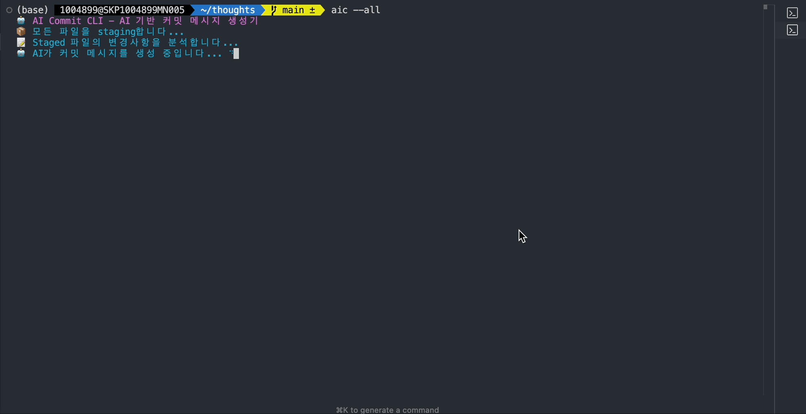

# 🤖 Gemini Commit Assistant



[English](README.md) | **한국어**

Google Gemini CLI (Gemini 2.5 Flash)를 사용하여 **한국어/영어 지원**하는 AI 커밋 메시지 생성기입니다.

## 📦 설치

```bash
npm install -g gemini-commit-assistant
```

## 🚀 사용법

```bash
# staged 파일로 커밋 메시지 생성
git add file1.js file2.js
aic # (또는 ai-commit)

# 모든 파일을 staging 후 커밋 메시지 생성
aic --all # (ai-commit --all)

# 언어 설정 (한국어/영어)
aic --configure # (ai-commit --configure)

# git alias 설정 (선택사항)
aic --setup # (ai-commit --setup)
git aic  # (git ai-commit)
```

## 🔧 옵션

| 옵션           | 설명                                    |
| -------------- | --------------------------------------- |
| `--all`, `-a`  | 모든 파일을 staging 후 커밋 메시지 생성 |
| `--configure`  | 언어 설정 변경 (한국어/English)         |
| `--setup`      | git alias 설정 (`git aic`)              |
| `--unsetup`    | git alias 해제                          |
| `--help`, `-h` | 도움말 표시                             |

## 💰 비용상 이점

**Gemini CLI 개인 계정 (권장):**

- **60회/분 + 1,000회/일** - 무료
- API 키 방식보다 10배 높은 제한
- 팀 전체 사용 가능

**API 키 방식:**

- 일일 100회만 무료 - 제한적

## 📋 요구사항

- Node.js 16.0.0+
- Git 2.0+
- **Gemini CLI** (설치: `npm install -g @google/gemini-cli`)
- **Google 계정** (개인 계정 권장)

## 🌐 언어 지원

최초 실행 시 언어 선택 화면이 자동으로 표시됩니다 (한국어/영어).
`aic --configure`로 언제든지 변경 가능합니다.

## 🛠️ 설정

```bash
# Gemini CLI 설치
npm install -g @google/gemini-cli

gemini # 이후 Google 계정으로 로그인
```

## 🎯 예시

**한국어 모드:**

```bash
aic
# 🤖 AI 커밋 메시지 생성기 (Gemini 기반)
# "feat: 사용자 인증 시스템 구현"
```

**영어 모드:**

```bash
aic
# 🤖 AI Commit CLI - AI-powered commit message generator
# "feat: Implement user authentication system"
```

## 📄 라이센스

MIT License
